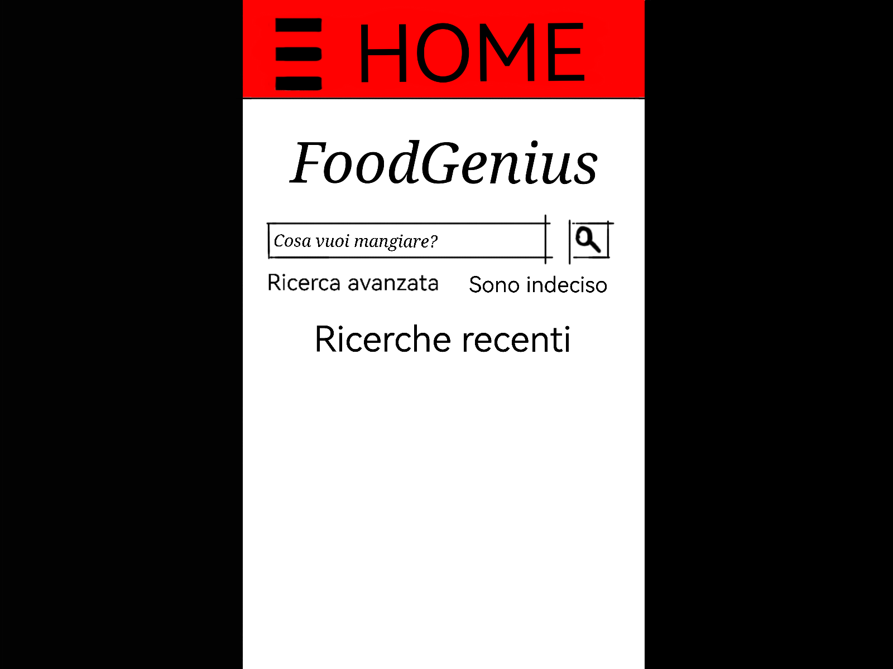

# Realizzazione

## 1.0: Ricettario
Ricettario che propone i piatti da cucinare e fornisce il procedimento per realizzarli,
il punto focale di questa applicazione è la ricerca che è sviluppata per aiutare l'utente
a scegliere una ricetta in base hai criteri immessi, oppure proporne una a caso.

## 1.1: Idea generale
L'applicazione inseriti gli ingredienti propone delle ricette, permette di aggiungerne delle altre nel
ricettario personale

## 1.2: Interfaccia
- Alert?

- Home
  - Ricerca avanzata (Tieni conto della dispensa, tipo di cucina, tipo di pasto)
  - Sono indeciso (linkato a ricettario)
  - Ricerche recenti (le ultime ricette 5 visualizzate prelevate da cronologia)

- Ricettario
  - Ricette trovate online
  - Ricette salvate (prese online)
  - Ricette personalizzate (ricette create dell'utente)
  - Se in dispensa non sono presenti tutti gli ingredienti. 
  Aggiungi gli incrediente mancanti alla spesa.

- Dispensa 
  - Lista dei prodotti posseduti dall'utente. Serve per affinare la ricerca nel ricettario.
  - Aggiunta manuale dei prodotti (nome, scadenza, quantità, peso)

- Cronologia
  - Lista di tutte le ricette viste di recente
  - Svuota cronologia

- Spesa
  - Lista della spesa
  - aggiungi un prodotto alla lista
  - rimuovi prodotto dalla lista
  - bottone acquistato. Il prodotto passa direttamente alla dispensa.

- Impostazioni
  - Lingua (italiano, inglese)
  - Tema (font, colori)
  
## 1.3: Funzioni
### Home
- Barra di ricerca: cerce su internet o tra le ricette salvate il piatto che l'utente ha digitato. 
- Ricerca avantaza: è possibile cercare la ricetta affinando la ricerca tramite 
dei filtri che possono essere:
  - Pasto (Colazione, Pranzo, Merenda o Cena)
  - Nazionalità del piatto
  - Tipologia di cucina
  - Kcal
  - A seconda degli ingredienti che si hanno a disposizione
- Sono indeciso: scegli a caso un piatto dal ricettario o da internet
- Ricerche recenti: mostra una cronologia degli ultimi piatti visti

### Ricettario
